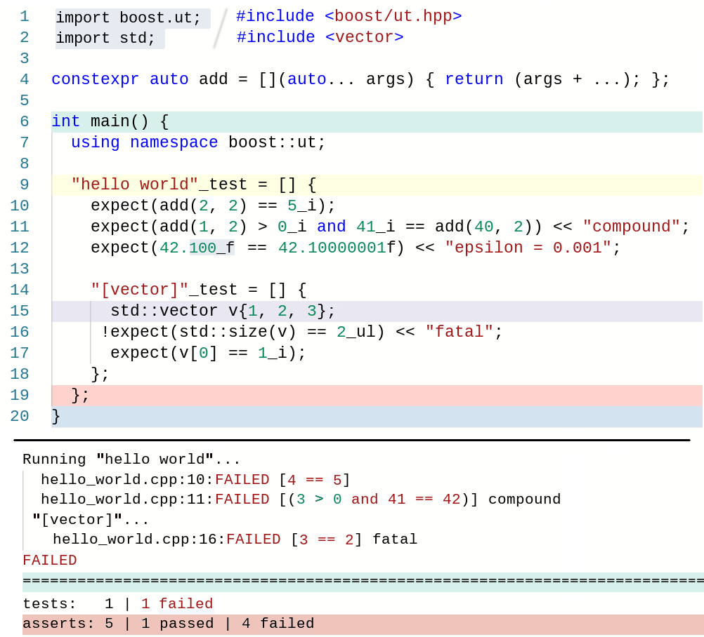
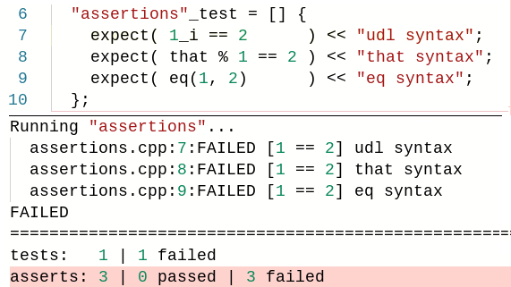

<a href="http://www.boost.org/LICENSE_1_0.txt" target="_blank"></a>
<a href="https://github.com/boost-experimental/ut/releases" target="_blank"></a>
<a href="https://travis-ci.org/boost-experimental/ut" target="_blank"></a>
<a href="https://ci.appveyor.com/project/krzysztof-jusiak/ut" target="_blank"></a>
<a href="https://codecov.io/gh/boost-experimental/ut" target="_blank"></a>
<a href="https://www.codacy.com/manual/krzysztof-jusiak/ut?utm_source=github.com&amp;utm_medium=referral&amp;utm_content=boost-experimental/ut&amp;utm_campaign=Badge_Grade" target="_blank"></a>
<a href="https://github.com/boost-experimental/ut/issues" target="_blank"></a>
<a href="https://godbolt.org/z/wCwkR9"></a>

> "If you liked it then you should have put a test on it", Beyonce rule

# [Boost].UT / μt

> C++20 **single header/single module, macro-free** μ(micro)/Unit Testing Framework

<p align="center">
  <a href="https://godbolt.org/z/uVDxkW"></a>
</p>

<a name="overview"></a>
<a name="quick-start"></a>
<details open><summary>Overview</summary>
<p>

* No dependencies ([C++20](https://en.cppreference.com/w/cpp/compiler_support#cpp2a) / Tested Compilers: [GCC-9+, Clang-9.0+](https://travis-ci.org/boost-experimental/ut), [MSVC-2019+*](https://ci.appveyor.com/project/krzysztof-jusiak/ut))
* Single header/module ([boost/ut.hpp](https://github.com/boost-experimental/ut/blob/master/include/boost/ut.hpp))
* Macro-free ([How does it work?](#how-it-works))
* Easy to use ([Minimal API](#api) - `suite, test, expect`)
* Fast to compile/execute ([Benchmarks](#benchmarks))
* Features ([Assertions](example/expect.cpp), [Suites](example/suite.cpp), [Tests](example/skip.cpp), [Sections](example/section.cpp), [Parameterized](example/parameterized.cpp), [BDD](example/BDD.cpp), [Matchers](example/matcher.cpp), [Logging](example/log.cpp), [Runners](example/cfg/runner.cpp), [Reporters](example/cfg/reporter.cpp), [...](example))

</p>
</details>

<a name="tutorial"></a>
<details><summary>Tutorial</summary>
<p>

<details><summary>&nbsp;&nbsp;&nbsp;&nbsp;Quick start</summary>
<p>

> Get the latest latest header/module [here!](https://github.com/boost-experimental/ut/blob/master/include/boost/ut.hpp)

| **C++ header** | **C++20 module** |
|-|-|
| `#include <boost/ut.hpp>` | `import boost.ut;` |

> **Main**

```cpp
int main() { }
```

> Compile & Run

```
$CXX main.cpp && ./a.out
All tests passed (0 assert in 0 test)
```

</p>
</details>

<details><summary>&nbsp;&nbsp;&nbsp;&nbsp;Assertions</summary>
<p>

> **First succesful assertion**

```cpp
int main() {
  boost::ut::expect(true);
}
```

```
All tests passed (1 asserts in 0 test)
```

> https://godbolt.org/z/vfx-eB


> **Failed assertion**

```cpp
int main() {
  boost::ut::expect(1 == 2);
}
```

```
main.cpp:4:FAILED [false]
===============================================================================
tests:   0 | 0 failed
asserts: 1 | 0 passed | 1 failed
```

> https://godbolt.org/z/7qTePx

---

> **Failed assertion with printed expression**

```cpp
int main() {
  using namespace boost::ut;
  expect(1_i == 2);
}
```

```
main.cpp:4:FAILED [1 == 2]
===============================================================================
tests:   0 | 0 failed
asserts: 1 | 0 passed | 1 failed
```

> https://godbolt.org/z/7MXVzu

---

> **Assertion with alternative expression syntax**

> <a href="https://godbolt.org/z/Df2nrN"></a>

```cpp
int main() {
  expect(1_i == 2);       // UDL syntax
  expect(1 == 2_i);       // UDL syntax
  expect(that % 1 == 2);  // Matcher syntax
  expect(eq(1, 2));       // eq/neq/gt/ge/lt/le
}
```

```
main.cpp:6:FAILED [1 == 2]
main.cpp:7:FAILED [1 == 2]
main.cpp:8:FAILED [1 == 2]
main.cpp:9:FAILED [1 == 2]
===============================================================================
tests:   0 | 0 failed
asserts: 4 | 0 passed | 4 failed
```

> https://godbolt.org/z/QbgGtc

---

> **Fatal assertion**

```cpp
int main() {
  !expect(1 == 2_i); // fatal assertion
   expect(1_i == 2); // not executed
}
```

```
main.cpp:6:FAILED [1 == 2]
===============================================================================
tests:   1 | 1 failed
asserts: 2 | 0 passed | 2 failed
```

> https://godbolt.org/z/469pH3

---

> **Assertion with a compound expressions**

```cpp
int main() {
  expect(42l == 42_l and 1 == 2_i);
}
```

```
main.cpp:5:FAILED [(42 == 42 and 1 == 2)]
===============================================================================
tests:   0 | 0 failed
asserts: 1 | 0 passed | 1 failed
```

> https://godbolt.org/z/aEhX4t

---

> **Assertion with a message**

```cpp
int main() {
  expect(42l == 42_l and 1 == 2_i) << "additional info";
}
```

```
main.cpp:5:FAILED [(42 == 42 and 1 == 2)] additional info
===============================================================================
tests:   0 | 0 failed
asserts: 1 | 0 passed | 1 failed
```

> https://godbolt.org/z/v2PDuU

</p>
</details>

<details><summary>&nbsp;&nbsp;&nbsp;&nbsp;Tests</summary>
<p>

> **First test**

```cpp
int main() {
  "hello world"_test = [] { };
}
```

```
All tests passed (0 asserts in 1 tests)
```

> https://godbolt.org/z/Bh-EmY

---

> **Test & Assertion**

```cpp
int main() {
  "hello world"_test = [] {
    int i = 42;
    expect(42_i == i);
  };
}
```

```
Running "hello world"...
  main.cpp:8:FAILED [42 == 43]
FAILED
===============================================================================
tests:   1 | 1 failed
asserts: 1 | 0 passed | 1 failed
```

> https://godbolt.org/z/Y43mXz

---

> **Logging**

```cpp
int main() {
  "logging"_test = [] {
    log << "pre";
    expect(that % 1 == 2) << "during";
    log << "post";
  };
```

```
Running "logging"...
pre
  logging.cpp:8:FAILED [1 == 2] during
post
===============================================================================
tests:   1 | 1 failed
asserts: 1 | 0 passed | 1 failed
```

> https://godbolt.org/z/6rmvvU

---

> **Sections**

```cpp
int main() {
  "[vector]"_test = [] {
    std::vector<int> v(5);

    !expect(5_ul == std::size(v));

    "resize bigger"_test = [=]() mutable {
      v.resize(10);
      expect(10_ul == std::size(v));
    };

    !expect(5_ul == std::size(v));

    "resize smaller"_test = [=]() mutable {
      v.resize(0);
      expect(0_ul == std::size(v));
    };
  }
}
```

```
All tests passed (4 asserts in 1 tests)
```

> https://godbolt.org/z/y9m5vF

---

> **Behaviour Driven Development** (BDD)

```cpp
int main() {
  "vector"_test = [] {
    given("I have a vector") = [] {
      std::vector<int> v(5);
      !expect(5_ul == std::size(v));

      when("I resize bigger") = [=]() mutable {
        v.resize(10);

        then("The size should increase") = [=] {
          expect(10_ul == std::size(v));
        };
      };
    };
  };
```

```
All tests passed (2 asserts in 1 tests)
```

> https://godbolt.org/z/ps9_EQ

---

> **Parameterized tests**
  * [Read more](#examples)

```cpp
int main() {
  "args"_test = [](const auto& arg) {
    expect(arg > 0_i) << "all values greater than 0";
  } | std::vector{1, 2, 3};
}
```

```
All tests passed (3 asserts in 3 tests)
```

> https://godbolt.org/z/6FHtpq

</p>
</details>

<details><summary>&nbsp;&nbsp;&nbsp;&nbsp;Suites</summary>
<p>

> **Test Suite**

```cpp
boost::ut::suite _ = [] {
  "suite"_test = [] {
    "should be equal"_test = [] { expect(42_i == 42); };
    "should not be equal "_test = [] { expect(1_i != 2); };
  };
}

int main() { }
```

```
All tests passed (2 asserts in 1 tests)
```

> https://godbolt.org/z/F3xJcJ

</p>
</details>

</p>
</details>

<a name="examples"></a>
<details><summary>Examples</summary>
<p>

<details><summary>&nbsp;&nbsp;&nbsp;&nbsp;Assertions</summary>
<p>

```cpp
// operators
expect(0_i == sum());
expect(2_i != sum(1, 2));
expect(sum(1) >= 0_i);
expect(sum(1) <= 1_i);

// message
expect(3_i == sum(1, 2)) << "wrong sum";

//expressions
expect(0_i == sum() and 42_i == sum(40, 2));
expect(0_i == sum() or 1_i == sum()) << "compound";

// that
expect(that % 0 == sum());
expect(that % 42 == sum(40, 2) and that % (1 + 2) == sum(1, 2));
expect(that % 1 != 2 or 2_i > 3);

// eq/neq/gt/ge/lt/le
expect(eq(42, sum(40, 2)));
expect(neq(1, 2));
expect(eq(sum(1), 1) and neq(sum(1, 2), 2));
expect(eq(1, 1) and that % 1 == 1 and 1_i == 1);

// floating points
expect(42.1_d == 42.101) << "epsilon=0.1";
expect(42.10_d == 42.101) << "epsilon=0.01";
expect(42.10000001 == 42.1_d) << "epsilon=0.1";

// constant
constexpr auto compile_time_v = 42;
auto run_time_v = 99;
expect(constant<42_i == compile_time_v> and run_time_v == 99_i);

// fatal
std::vector v{1, 2, 3};
!expect(std::size(v) == 3_ul) << "fatal assertion";
expect(v[0] == 1_i);
expect(v[1] == 2_i);
expect(v[2] == 3_i);

// failure
expect(1_i == 2) << "should fail";
expect(sum() == 1_i or 2_i == sum()) << "sum?";
```

```
assertions.cpp:53:FAILED [1 == 2] should fail
assertions.cpp:54:FAILED [(0 == 1 or 2 == 0)] sum?
===============================================================================
tests:   0 | 0 failed
asserts: 24 | 22 passed | 2 failed
```

> https://godbolt.org/z/jaFK8w

</p>
</details>

<details><summary>&nbsp;&nbsp;&nbsp;&nbsp;Tests</summary>
<p>

```cpp
"run"_test = [] {
  expect(42_i == 42);
};

skip | "don't run"_test = [] {
  expect(42_i == 43) << "should not fire!";
};
```

```
All tests passed (1 asserts in 1 tests)
1 tests skipped
```

> https://godbolt.org/z/G5rkAw

</p>
</details>

<details><summary>&nbsp;&nbsp;&nbsp;&nbsp;Sections</summary>
<p>

```cpp
"[vector]"_test = [] {
  std::vector<int> v(5);

  !expect(5_ul == std::size(v));

  "resize bigger"_test = [=]() mutable {
    v.resize(10);
    expect(10_ul == std::size(v));
  };

  !expect(5_ul == std::size(v));

  "resize smaller"_test = [=]() mutable {
    v.resize(0);
    expect(0_ul == std::size(v));
  };
};
```

```
All tests passed (4 asserts in 1 tests)
```

> https://godbolt.org/z/qKxsf9)

</p>
</details>

<details><summary>&nbsp;&nbsp;&nbsp;&nbsp;Parameterized</summary>
<p>

```cpp
"args"_test =
   [](const auto& arg) {
      expect(arg >= 1_i);
    }
  | std::vector{1, 2, 3};

"types"_test =
    []<class T> {
      expect(std::is_integral_v<T>) << "all types are integrals";
    }
  | std::tuple<bool, int>{};

"args and types"_test =
    []<class TArg>(const TArg& arg) {
      !expect(std::is_integral_v<TArg>);
       expect(42_i == arg or true_b == arg);
       expect(type<TArg> == type<int> or type<TArg> == type<bool>);
    }
  | std::tuple{true, 42};
```

```
All tests passed (11 asserts in 7 tests)
```

> https://godbolt.org/z/WCqggN

</p>
</details>

<details><summary>&nbsp;&nbsp;&nbsp;&nbsp;Behavior Driven Development (BDD)</summary>
<p>

```cpp
"scenario"_test = [] {
  given("I have...") = [] {
    when("I run...") = [] {
      then("I expect...") = [] { expect(1_i == 1); };
      then("I expect...") = [] { expect(1 == 1_i); };
    };
  };
};
```

```
All tests passed (2 asserts in 1 tests)
```

> https://godbolt.org/z/5nhdyn

</p>
</details>

<details><summary>&nbsp;&nbsp;&nbsp;&nbsp;Suites</summary>
<p>

```cpp
namespace ut = boost::ut;

ut::suite _ = [] {
  using namespace ut;

  "equality/exceptions"_test = [] {
    "should equal"_test = [] {
      expect(42_i == 42);
    };

    "should throw"_test = [] {
      expect(throws([]{throw 0;}));
    };
  };
};

int main() { }
```

```
All tests passed (2 asserts in 1 tests)
```

> https://godbolt.org/z/CFbTP9

</p>
</details>

<details><summary>&nbsp;&nbsp;&nbsp;&nbsp;Misc</summary>
<p>

<details><summary>&nbsp;&nbsp;&nbsp;&nbsp;&nbsp;&nbsp;&nbsp;&nbsp;Logging</summary>
<p>

```cpp
"logging"_test = [] {
  log << "pre";
  expect(42_i == 43) << "message on failure";
  log << "post";
};
```

```
Running "logging"...
pre
  logging.cpp:8:FAILED [42 == 43] message on failure
post
FAILED

===============================================================================

tests:   1 | 1 failed
asserts: 1 | 0 passed | 1 failed
```

> https://godbolt.org/z/26fPSY

</p>
</details>

<details><summary>&nbsp;&nbsp;&nbsp;&nbsp;&nbsp;&nbsp;&nbsp;&nbsp;Matchers</summary>
<p>

```cpp
"matchers"_test = [] {
  constexpr auto is_between = [](auto lhs, auto rhs) {
    return matcher([=](auto value) {
      return that % value >= lhs and that % value <= rhs;
    });
  };

  expect(is_between(1, 100)(42));
  expect(not is_between(1, 100)(0));
};
```

```
All tests passed (1 asserts in 1 tests)
```

> https://godbolt.org/z/nrJyV-

</p>
</details>

<details><summary>&nbsp;&nbsp;&nbsp;&nbsp;&nbsp;&nbsp;&nbsp;&nbsp;Exceptions/Aborts</summary>
<p>

```cpp
"exceptions/aborts"_test = [] {
  expect(throws<std::runtime_error>([]{throw std::runtime_error{""};}))
    << "throws runtime_error";
  expect(throws([]{throw 0;})) << "throws any exception";
  expect(nothrow([]{})) << "doesn't throw";
  expect(aborts([] { assert(false); }));
};
```

```
All tests passed (4 asserts in 1 tests)
```

> https://godbolt.org/z/A2EehK)

</p>
</details>

</p>
</details>

<details><summary>&nbsp;&nbsp;&nbsp;&nbsp;Config</summary>
<p>

<details><summary>&nbsp;&nbsp;&nbsp;&nbsp;&nbsp;&nbsp;&nbsp;&nbsp;Runner</summary>
<p>

```cpp
namespace ut = boost::ut;

namespace cfg {
  class runner {
   public:
    template <class... Ts> auto on(ut::events::test<Ts...> test) { test(); }
    template <class... Ts> auto on(ut::events::skip<Ts...>) {}
    template <class TLocation, class TExpr>
    auto on(ut::events::assertion<TLocation, TExpr>) -> bool { return true; }
    auto on(ut::events::fatal_assertion) {}
    template <class TMsg> auto on(ut::events::log<TMsg>) {}
  };
} // namespace cfg

template<> auto ut::cfg<ut::override> = cfg::runner{};
```

> https://godbolt.org/z/jdg687

</p>
</details>

<details><summary>&nbsp;&nbsp;&nbsp;&nbsp;&nbsp;&nbsp;&nbsp;&nbsp;Reporter</summary>
<p>

```cpp
namespace ut = boost::ut;

namespace cfg {
  class reporter {
   public:
    auto on(ut::events::test_begin) -> void {}
    auto on(ut::events::test_run) -> void {}
    auto on(ut::events::test_skip) -> void {}
    auto on(ut::events::test_end) -> void {}
    template <class TMsg> auto on(ut::events::log<TMsg>) -> void {}
    template <class TLocation, class TExpr>
    auto on(ut::events::assertion_pass<TLocation, TExpr>) -> void {}
    template <class TLocation, class TExpr>
    auto on(ut::events::assertion_fail<TLocation, TExpr>) -> void {}
    auto on(ut::events::fatal_assertion) -> void {}
    auto on(ut::events::exception) -> void {}
    auto on(ut::events::summary) -> void {}
  };
}  // namespace cfg

template <>
auto ut::cfg<ut::override> = ut::runner<cfg::reporter>{};
```

> https://godbolt.org/z/gsAPKg

</p>
</details>

</p>
</details>

</p>
</details>

<a name="api"></a>
<a name="configuration"></a>
<a name="user-guide"></a>
<details><summary>User Guide</summary>
<p>

<details><summary>&nbsp;&nbsp;&nbsp;&nbsp;API</summary>
<p>

```cpp
export module boost.ut; /// __cpp_modules

namespace boost::ut::inline v1_1_1 {
  /**
   * Represents test suite object
   */
  struct suite final {
    /**
     * Creates and executes test suite
     * @example suite _ = [] {};
     * @param suite test suite function
     */
    constexpr explicit(false) suite(auto suite);
  };

  /**
   * Creates a test
   * @example "test name"_test = [] {};
   * @return test object to be executed
   */
  constexpr auto operator""_test;

  /**
   * Behaviour Driven Development (BDD) helper functions
   * @param name step name
   * @return test object to be executed
   */
  constexpr auto given = [](auto name);
  constexpr auto when  = [](auto name);
  constexpr auto then  = [](auto name);

  /**
   * Evaluates an expression
   * @example expect(42 == 42_i and 1 != 2_i);
   * @param expr expression to be evaluated
   * @param location [source code location](https://en.cppreference.com/w/cpp/utility/source_location))
   * @return stream
   */
  constexpr OStream& expect(
    Expression expr,
    const std::source_location& location = std::source_location::current()
  );

  struct {
    /**
     * @example (that % 42 == 42);
     * @param expr expression to be evaluated
     */
    [[nodiscard]] constexpr auto operator%(Expression expr) const;
  } that{};

  /**
   * @example auto gt_0 = matcher([](auto arg){ return that % arg > 0; })
   */
  struct matcher {
    /**
     * @param expr matcher expression
     */
    constexpr explicit(true) matcher_(Expression expr);

    /**
     * Executes matcher expression
     * @param args arguments to be passed to a matcher expression
     */
    [[nodiscard]] constexpr auto operator()(const Args&... args) const;
  };

  inline namespace literals {
    /**
     * User defined literals to represent constant values
     * @example 42_i, 0_uc, 1.23_d
     */
    constexpr auto operator""_i;  /// int
    constexpr auto operator""_s;  /// short
    constexpr auto operator""_c;  /// char
    constexpr auto operator""_l;  /// long
    constexpr auto operator""_ll; /// long long
    constexpr auto operator""_u;  /// unsigned
    constexpr auto operator""_uc; /// unsigned char
    constexpr auto operator""_us; /// unsigned short
    constexpr auto operator""_ul; /// unsigned long
    constexpr auto operator""_f;  /// float
    constexpr auto operator""_d;  /// double
    constexpr auto operator""_ld; /// long double

    /**
     * Represents dynamic values
     * @example _i(42), _f(42.)
     */
    constexpr auto _b(bool);
    constexpr auto _c(char);
    constexpr auto _s(short);
    constexpr auto _i(int);
    constexpr auto _l(long);
    constexpr auto _ll(long long);
    constexpr auto _u(unsigned);
    constexpr auto _uc(unsigned char);
    constexpr auto _us(unsigned short);
    constexpr auto _ul(unsigned long);
    constexpr auto _f(float);
    constexpr auto _d(double);
    constexpr auto _ld(long double);

    /**
     * Logical representation of constant values
     */
    constexpr auto true_b;        /// true
    constexpr auto false_b;       /// false
  } // namespace literals

  inline namespace operators {
    /**
     * Comparison functions to be used in expressions
     * @example eq(42, 42), neq(1, 2)
     */
    constexpr auto eq(Operator lhs, Operator rhs);  /// ==
    constexpr auto neq(Operator lhs, Operator rhs); /// !=
    constexpr auto gt(Operator lhs, Operator rhs);  /// >
    constexpr auto ge(Operator lhs, Operator rhs);  /// >=
    constexpr auto lt(Operator lhs, Operator rhs);  /// <
    constexpr auto le(Operator lhs, Operator rhs);  /// <=

    /**
     * Overloaded comparison operators to be used in expressions
     * @example (42_i != 0)
     */
    constexpr auto operator==;
    constexpr auto operator!=;
    constexpr auto operator>;
    constexpr auto operator>=;
    constexpr auto operator<;
    constexpr auto operator<=;

    /**
     * Overloaded logic operators to be used in expressions
     * @example (42_i != 0 and 1 == 2_i)
     */
    constexpr auto operator and;
    constexpr auto operator or;
    constexpr auto operator not;

    /**
     * Executes parameterized tests
     * @example "parameterized"_test = [](auto arg) {} | std::tuple{1, 2, 3};
     */
    constexpr auto operator|;
  } // namespace operators

  /**
   * Creates skippable test object
   * @example skip | "don't run"_test = [] { };
   */
  struct { } skip{};

  struct {
    /**
     * @example log << "message!";
     * @param msg stringable message
     */
    auto& operator<<(Msg msg);
  } log{};

  /**
   * Default execution flow policy
   */
  class runner {
   public:
    /**
     * @example cfg<override> = { .filter = "test.section.*", .dry_run = true };
     * @param options.filter runs all tests which names matches test.section.* filter
     * @param options.dry_run if true then print test names to be executed without running them
     */
    auto operator=(options);

    /**
     * @example suite _ = [] {};
     * @param suite() executes suite
     */
    template<class TSuite>
    auto on(ut::events::suite<TSuite>);

    /**
     * @example "name"_test = [] {};
     * @param test.type ["test", "given", "when", "then"]
     * @param test.name "name"
     * @param test.arg parameterized argument
     * @param test() executes test
     */
    template<class... Ts>
    auto on(ut::events::test<Ts...>);

    /**
     * @example skip | "don't run"_test = []{};
     * @param skip.type ["test", "given", "when", "then"]
     * @param skip.name "don't run"
     * @param skip.arg parameterized argument
     */
    template<class... Ts>
    auto on(ut::events::skip<Ts...>);

    /**
     * @example file.cpp:42: expect(42_i == 42);
     * @param assertion.location { "file.cpp", 42 }
     * @param assertion.expr 42_i == 42
     * @return true if expr passes, false otherwise
     */
    template <class TLocation, class TExpr>
    auto on(ut::events::assertion<TLocation, TExpr>) -> bool;

    /**
     * @example !expect(2_i == 1)
     * @note triggered by `!expect`
     *       should std::exit
     */
    auto on(ut::events::fatal_assertion);

    /**
     * @example log << "message"
     * @param log.msg "message"
     */
    template<class TMsg>
    auto on(ut::events::log<TMsg>);
  };

  /**
   * Default reporter policy
   */
  class reporter {
   public:
    /**
     * @example "name"_test = [] {};
     * @param test_begin.type ["test", "given", "when", "then"]
     * @param test_begin.name "name"
     */
    auto on(ut::events::test_begin) -> void;

    /**
     * @example "name"_test = [] {};
     * @param test_run.type ["test", "given", "when", "then"]
     * @param test_run.name "name"
     */
    auto on(ut::events::test_run) -> void;

    /**
     * @example "name"_test = [] {};
     * @param test_skip.type ["test", "given", "when", "then"]
     * @param test_skip.name "name"
     */
    auto on(ut::events::test_skip) -> void;

    /**
     * @example "name"_test = [] {};
     * @param test_end.type ["test", "given", "when", "then"]
     * @param test_end.name "name"
     */
    auto on(ut::events::test_end) -> void;

    /**
     * @example log << "message"
     * @param log.msg "message"
     */
    template<class TMsg>
    auto on(ut::events::log<TMsg>) -> void;

    /**
     * @example file.cpp:42: expect(42_i == 42);
     * @param assertion_pass.location { "file.cpp", 42 }
     * @param assertion_pass.expr 42_i == 42
     */
    template <class TLocation, class TExpr>
    auto on(ut::events::assertion_pass<TLocation, TExpr>) -> void;

    /**
     * @example file.cpp:42: expect(42_i != 42);
     * @param assertion_fail.location { "file.cpp", 42 }
     * @param assertion_fail.expr 42_i != 42
     */
    template <class TLocation, class TExpr>
    auto on(ut::events::assertion_fail<TLocation, TExpr>) -> void;

    /**
     * @example !expect(2_i == 1)
     * @note triggered by `!expect`
     *       should std::exit
     */
    auto on(ut::events::fatal_assertion) -> void;

    /**
     * @example "exception"_test = [] { throw std::runtime_error{""}; };
     */
    auto on(ut::events::exception) -> void;

    /**
     * @note triggered on destruction of runner
     */
    auto on(ut::events::summary) -> void;
  };

  /**
   * Used to override default running policy
   * @example template <> auto cfg<override> = runner<reporter>{};
   */
  struct override {};

  /**
   * Default UT execution policy
   * Can be overwritten with override
   */
  template <class = override> auto cfg = runner<reporter>{};
} // namespace boost::ut
```

</p>
</details>

<details><summary>&nbsp;&nbsp;&nbsp;&nbsp;Configuration</summary>
<p>

| Option | Description | Example |
|-|-|-|
| `BOOST_UT_VERSION`        | Current version | `1'1'1` |
| `BOOST_UT_FORWARD`        | Optionally used in `.cpp` files to speed up compilation of multiple suites | |
| `BOOST_UT_IMPLEMENTATION` | Optionally used in `main.cpp` file to provide `ut` implementation (have to be used in combination with `BOOST_UT_FORWARD`) | |

</p>
</details>

</p>
</details>

<a name="faq"></a>
<a name="how-it-works"></a>
<a name="macro"></a>
<details><summary>FAQ</summary>
<p>

<details><summary>&nbsp;&nbsp;&nbsp;&nbsp;How does it work?</summary>
<p>

> `suite`

  ```cpp
  /**
   * Reperesents suite object
   * @example suite _ = []{};
   */
  struct suite final {
    /**
     * Assigns and executes test suite
     */
    [[nodiscard]] constexpr explicit(false) suite(Suite suite) {
      suite();
    }
  };
  ```

> `test`

  ```cpp
  /**
   * Creates named test object
   * @example "hello world"_test
   * @return test object
   */
  [[nodiscard]] constexpr Test operator ""_test(const char* name, std::size_t size) {
    return test{{name, size}};
  }
  ```

  ```cpp
  /**
   * Represents test object
   */
  struct test final {
    std::string_view name{}; /// test case name

    /**
     * Assigns and executes test function
     * @param test function
     */
    constexpr auto operator=(const Test& test) {
      std::cout << "Running... " << name << '\n';
      test();
    }
  };
  ```

> `expect`

  ```cpp
  /**
   * Evaluates an expression
   * @example expect(42_i == 42);
   * @param expr expression to be evaluated
   * @param location [source code location](https://en.cppreference.com/w/cpp/utility/source_location))
   * @return stream
   */
  constexpr OStream& expect(
    Expression expr,
    const std::source_location& location = std::source_location::current()
  ) {
    if (not static_cast<bool>(expr) {
      std::cerr << location.file()
                << ':'
                << location.line()
                << ":FAILED: "
                << expr
                << '\n';
    }

    return std::cerr;
  }
  ```

  ```cpp
  /**
   * Creates constant object for which operators can be overloaded
   * @example 42_i
   * @return integral constant object
   */
  template <char... Cs>
  [[nodiscard]] constexpr Operator operator""_i() -> integral_constant<int, value<Cs...>>;
  ```

  ```cpp
  /**
   * Overloads comparison if at least one of {lhs, rhs} is an Operator
   * @example (42_i == 42)
   * @param lhs Left-hand side operator
   * @param rhs Right-hand side operator
   * @return Comparison object
   */
  [[nodiscard]] constexpr auto operator==(Operator lhs, Operator rhs) {
    return eq{lhs, rhs};
  }
  ```

  ```cpp
  /**
   * Comparison Operator
   */
  template <Operator TLhs, Opeartor TRhs>
  struct eq final {
    TLhs lhs{}; // Left-hand side operator
    TRhs rhs{}; // Right-hand side operator

    /**
     * Performs comparison operatation
     * @return true if expression is succesful
     */
    [[nodiscard]] constexpr explicit operator bool() const {
      return lhs == rhs;
    }

    /**
     * Nicely prints the operation
     */
    friend auto operator<<(OStream& os, const eq& op) -> Ostream& {
      return (os << op.lhs << " == " << op.rhs);
    }
  };
  ```

</p>
</details>

<details><summary>&nbsp;&nbsp;&nbsp;&nbsp;Can I still use macros?</summary>
<p>

```cpp
#define EXPECT(...) ::boost::ut::expect(::boost::ut::that % __VA_ARGS__)
#define SUITE       ::boost::ut::suite _ = []
#define TEST(name)  ::boost::ut::detail::test{"test", name} = [=]() mutable

SUITE {
  TEST("suite") {
    EXPECT(42 == 42);
  };
};

int main() {
  TEST("macro") {
    EXPECT(1 != 2);
  };

  TEST("vector") {
    std::vector<int> v(5);

   !EXPECT(5u == std::size(v)) << "fatal";

    TEST("resize bigger") {
      v.resize(10);
      EXPECT(10u == std::size(v));
    };
  };
}
```

```
All tests passed (4 asserts in 3 tests)
```

> https://godbolt.org/z/tvy-nP

</p>
</details>

</p>
</details>

<a name="benchmarks"></a>
<details><summary>Benchmarks</summary>
<p>

| Framework | Version | Standard | License | Linkage | Test configuration |
|-|-|-|-|-|-|
| **[Boost.Test](https://github.com/boostorg/test)** | [1.71.0](https://www.boost.org/users/history/version_1_71_0.html) | C++03 | Boost 1.0 | single header/library | `static library` |
| **[GoogleTest](https://github.com/google/googletest)** | [1.10.0](https://github.com/google/googletest/releases/tag/release-1.10.0) | C++11 | BSD-3 | library | `static library` |
| **[Catch](https://github.com/catchorg/Catch2)** | [2.10.2](https://github.com/catchorg/Catch2/releases/download/v2.10.2/catch.hpp) | C++11 | Boost 1.0 | single header | `CATCH_CONFIG_FAST_COMPILE` |
| **[Doctest](https://github.com/onqtam/doctest)** | [2.3.5](https://github.com/onqtam/doctest/blob/master/doctest/doctest.h) | C++11 | MIT | single header | `DOCTEST_CONFIG_SUPER_FAST_ASSERTS` |
| **[μt](https://github.com/boost-experimental/ut)** | [1.1.0](https://github.com/boost-experimental/ut/blob/master/include/boost/ut.hpp) | C++20 | Boost 1.0 | single header/module | |

<table>
  <tr>
    <td colspan="3" align="center">
    <a href="https://github.com/cpp-testing/ut-benchmark/tree/master/benchmarks"><b>Include</b></a> / <i>0 tests, 0 asserts, 1 cpp file</i>
    </td>
  </tr>
  <tr>
    <td colspan="3" align="center"><a href="https://raw.githubusercontent.com/cpp-testing/ut-benchmark/master/results/Compilation_include.png"></a></td>
    <td></td>
  </tr>

  <tr>
    <td colspan="3" align="center">
    <a href="https://github.com/cpp-testing/ut-benchmark/tree/master/benchmarks"><b>Assert</b></a> / <i>1 test, 1'000'000 asserts, 1 cpp file</i>
    </td>
  </tr>
  <tr>
    <td><a href="https://raw.githubusercontent.com/cpp-testing/ut-benchmark/master/results/Compilation_assert.png"></a></td>
    <td><a href="https://raw.githubusercontent.com/cpp-testing/ut-benchmark/master/results/Execution_assert.png"></a></td>
    <td><a href="https://raw.githubusercontent.com/cpp-testing/ut-benchmark/master/results/BinarySize_assert.png"></a></td>
  </tr>

  <tr>
    <td colspan="3" align="center">
    <a href="https://github.com/cpp-testing/ut-benchmark/tree/master/benchmarks"><b>Test</b></a> / <i>1'000 tests, 0 asserts, 1 cpp file</i>
    </td>
  </tr>
  <tr>
    <td><a href="https://raw.githubusercontent.com/cpp-testing/ut-benchmark/master/results/Compilation_test.png"></a></td>
    <td><a href="https://raw.githubusercontent.com/cpp-testing/ut-benchmark/master/results/Execution_test.png"></a></td>
    <td><a href="https://raw.githubusercontent.com/cpp-testing/ut-benchmark/master/results/BinarySize_test.png"></a></td>
  </tr>

  <tr>
    <td colspan="3" align="center">
    <a href="https://github.com/cpp-testing/ut-benchmark/tree/master/benchmarks"><b>Suite</b></a> / <i>10'000 tests, 0 asserts, 100 cpp files</i>
    </td>
  </tr>
  <tr>
    <td><a href="https://raw.githubusercontent.com/cpp-testing/ut-benchmark/master/results/Compilation_suite.png"></a></td>
    <td><a href="https://raw.githubusercontent.com/cpp-testing/ut-benchmark/master/results/Execution_suite.png"></a></td>
    <td><a href="https://raw.githubusercontent.com/cpp-testing/ut-benchmark/master/results/BinarySize_suite.png"></a></td>
  </tr>

  <tr>
    <td colspan="3" align="center">
    <a href="https://github.com/cpp-testing/ut-benchmark/tree/master/benchmarks"><b>Suite+Assert</b></a> / <i>10'000 tests, 40'000 asserts, 100 cpp files</i>
    </td>
  </tr>
  <tr>
    <td><a href="https://raw.githubusercontent.com/cpp-testing/ut-benchmark/master/results/Compilation_suite+assert.png"></a></td>
    <td><a href="https://raw.githubusercontent.com/cpp-testing/ut-benchmark/master/results/Execution_suite+assert.png"></a></td>
    <td><a href="https://raw.githubusercontent.com/cpp-testing/ut-benchmark/master/results/BinarySize_suite+assert.png"></a></td>
  </tr>

  <tr>
    <td colspan="3" align="center">
    <a href="https://github.com/cpp-testing/ut-benchmark/tree/master/benchmarks"><b>Suite+Assert+STL</b></a> / <i>10'000 tests, 20'000 asserts, 100 cpp files</i>
    </td>
  </tr>
  <tr>
    <td><a href="https://raw.githubusercontent.com/cpp-testing/ut-benchmark/master/results/Compilation_suite+assert+stl.png"></a></td>
    <td><a href="https://raw.githubusercontent.com/cpp-testing/ut-benchmark/master/results/Execution_suite+assert+stl.png"></a></td>
    <td><a href="https://raw.githubusercontent.com/cpp-testing/ut-benchmark/master/results/BinarySize_suite+assert+stl.png"></a></td>
  </tr>

  <tr>
    <td colspan="3" align="center">
    <a href="https://github.com/cpp-testing/ut-benchmark/tree/master/benchmarks"><b>Suite+Assert+STL</b></a> / <i>10'000 tests, 20'000 asserts, 100 cpp files<br/>(Headers vs Precompiled headers vs C++20 Modules)</i>
    </td>
  </tr>
  <tr>
    <td><a href="https://raw.githubusercontent.com/cpp-testing/ut-benchmark/master/results/ut_Compilation_suite+assert+stl.png"></a></td>
    <td><a href="https://raw.githubusercontent.com/cpp-testing/ut-benchmark/master/results/ut_Execution_suite+assert+stl.png"></a></td>
    <td><a href="https://raw.githubusercontent.com/cpp-testing/ut-benchmark/master/results/ut_BinarySize_suite+assert+stl.png"></a></td>
  </tr>
</table>

> https://github.com/cpp-testing/ut-benchmark

</p>
</details>

---

**Disclaimer** `[Boost].UT` is not an official Boost library.

<p align="left"></p>
